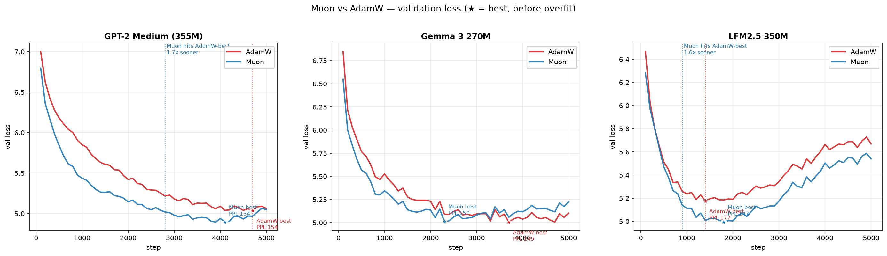
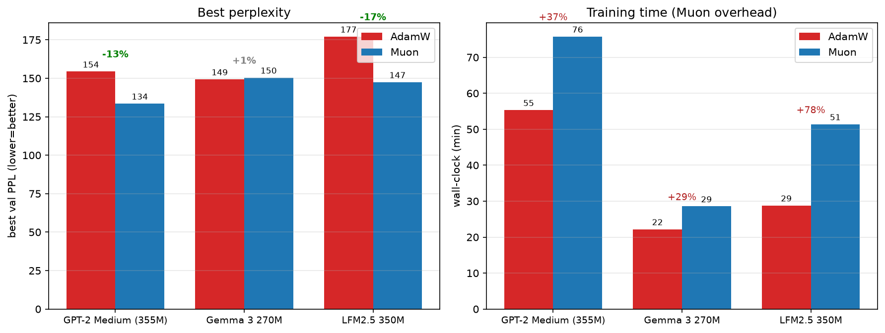

# Muon vs AdamW — a fair, from-scratch optimizer comparison

Everyone pretrains and fine-tunes LLMs with **AdamW**. [**Muon**](https://github.com/KellerJordan/Muon)
is the newer optimizer behind several nanoGPT speed records, and it's now used at scale
(Moonshot's Moonlight / Kimi). This repo asks a simple question with receipts:

> Train the *same* small model from scratch, twice — once with AdamW, once with Muon — change
> nothing else. Who wins, and why?

**TL;DR:** Muon won on **2 of 3** models by **13–17%** perplexity and reached AdamW's best loss
**~1.5–1.7× sooner** — but it **tied** on the third, and that tie turns out to be the most
interesting result.



---

## Results

Three ~300–355M models, randomly initialized **from their HuggingFace config** (so this is
*from-scratch pretraining*, not fine-tuning), trained on WikiText-2 for 5,000 steps. Identical
data, schedule, seed, weight decay, and grad clipping — the **only** difference is the optimizer.



| Model | Muon-governed params | AdamW best PPL | Muon best PPL | Δ | Muon time overhead |
|---|---|---|---|---|---|
| **GPT-2-medium (355M)** | 85% | 154 | **134** | **−13%** | +37% |
| **LFM2.5 (350M)** | 81% | 177 | **147** | **−17%** | +78% |
| **Gemma 3 (270M)** | 37% | 149 | 150 | +1% (tie) | +29% |

*(Perplexity is only comparable **within** a model — the three use different tokenizers/vocabs.)*

### The key insight: Muon's edge scales with how much of the model it controls

Muon only optimizes the **2D hidden weight matrices**. Embeddings, the LM head, LayerNorm gains
and biases always go to AdamW — that's how Muon is actually used in practice, not a choice we made.

Gemma-3 has a **256k-token vocabulary**, so its embedding table is most of its parameters. Muon
therefore governed only **37%** of Gemma's weights — versus **85% / 81%** for GPT-2-medium / LFM —
and with so little to act on, its advantage washed out. The "tie" isn't Muon underperforming; it's
**dilution**. If you reach for Muon on a big-vocab model, expect a smaller win.

### Honesty notes (this is what makes the comparison credible)

- **Muon isn't free.** Newton-Schulz orthogonalization cost **+29% to +78%** wall-clock. A per-step
  win can be a per-second loss — always report both axes.
- **WikiText-2 is tiny**, so every model overfits after ~1.5–2.8k steps. We report **best val** (the
  ★ in the plot), not final.
- **Single seed, untuned learning rates** (AdamW `3e-4`, Muon `0.02`). Muon won anyway, which is a
  *stronger* result — but the next iteration adds 2 seeds + an LR sweep + a larger corpus.

---

## Run it yourself

The notebook is self-contained and runs on a free **Colab/Kaggle** GPU.

1. Open [`muon_vs_adamw.ipynb`](muon_vs_adamw.ipynb) in Colab or Kaggle, set the runtime to **GPU**.
2. (Optional) `huggingface-cli login` to use gated models like Gemma. **Never hardcode a token in
   the notebook.**
3. Edit the `MODELS` dict / `CFG` (model ids, steps, batch size) and **Run All**.

```bash
pip install -r requirements.txt   # torch, transformers, datasets, matplotlib, accelerate
```

The reference Muon (single-device, Keller Jordan's quintic Newton-Schulz) is vendored in the
notebook; AdamW is `torch.optim.AdamW`. Param routing (2D matrices → Muon, embeddings/norms →
AdamW) is generic and works on any HuggingFace causal-LM architecture.

---

## Roadmap — extension studies

This is **Part 1 of a planned 3-part study**. Contributions welcome on the open items.

- [ ] **Part 2 — Muon under LoRA / QLoRA fine-tuning.** The sharp question: Muon orthogonalizes
  gradients to be *full-rank*, but LoRA *forces* the update low-rank (`ΔW = B·A`). Does Muon's edge
  survive when the update is rank-capped, or does it vanish? (Early experiments suggest the naive
  aspect-ratio scaling over-steps the LoRA up-projection ~10–17× — itself worth a write-up.)
- [ ] **Supplementary — Muon internals.** Cheap, high-insight ablations on the same small models:
  Newton-Schulz step count (how much orthogonalization is actually needed?), the update-scaling
  knob, LR-robustness basin, and what orthogonal updates do to weight-matrix rank over training.
- [ ] **Auxiliary / help wanted — full fine-tuning at 1–4B.** Does pretraining-Muon's edge transfer
  to full-parameter fine-tuning of an *already-pretrained* model? Single-GPU-feasible at ≤~2B; the
  reference Muon here is single-device only, so anything sharded (FSDP) needs a distributed Muon.

---

## Credits & references

- **Muon** — Keller Jordan, [github.com/KellerJordan/Muon](https://github.com/KellerJordan/Muon)
  (quintic Newton-Schulz orthogonalization).
- Models: GPT-2 (OpenAI), Gemma 3 (Google), LFM2.5 (Liquid AI) — loaded via 🤗 Transformers.
- Data: WikiText-2.

If you spot a methodology flaw, please open an issue — fair optimizer comparisons are hard and
adversarial review is the point.
