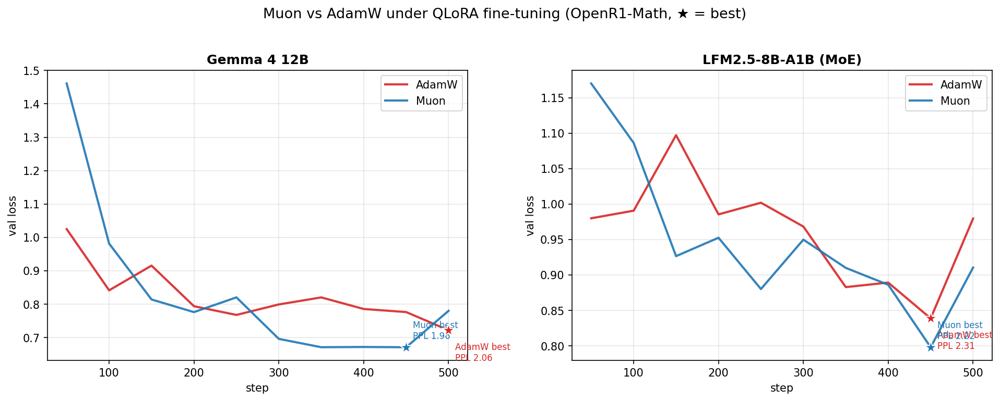
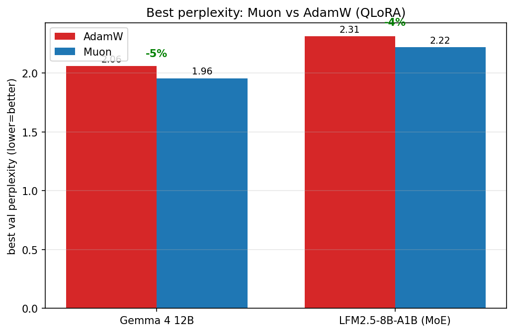

# Part 2 — Muon vs AdamW under QLoRA fine-tuning

**Does Muon's edge survive LoRA?** Muon orthogonalizes the gradient so the update is *full-rank*
(every singular value → 1). LoRA *forces* the update **low-rank** (`ΔW = B·A`, rank `r`) — fighting
Muon's whole premise. We expected the rank cap to neutralize Muon. **It didn't.**

We fine-tune a frozen **4-bit (NF4) QLoRA** base, put LoRA on all language-model linear layers, and
swap only the optimizer driving the adapters.

- **Models:** Gemma-4-12B, LFM2.5-8B-A1B (MoE). *(Qwen-3.5-9B run incomplete — Muon arm to re-run.)*
- **Data:** [OpenR1-Math-220k](https://huggingface.co/datasets/open-r1/OpenR1-Math-220k) — hard
  competition math with compact reference solutions (response-masked SFT loss).
- **Setup:** QLoRA 4-bit NF4, LoRA `r=16, α=32`, 500 steps, seq 512, effective batch 8,
  **1× NVIDIA A40 (48GB)**.

## Result: Muon wins — and essentially for free

| Model | AdamW best PPL | Muon best PPL | Δ | AdamW time | Muon time | Muon overhead |
|---|---|---|---|---|---|---|
| **Gemma-4-12B** | 2.06 | **1.96** | **−5%** | 57.3 min | 59.7 min | +4% |
| **LFM2.5-8B-A1B (MoE)** | 2.31 | **2.22** | **−4%** | 25.3 min | 25.1 min | −1% |

Muon reaches a **lower best validation perplexity** on both models — clearest on Gemma, where its
curve drops below AdamW around step ~300 and stays there. So orthogonalizing the adapter gradients
keeps helping even though `B·A` is rank-capped.

**The cost angle:** in Part 1 (pretraining) Muon was **37–78% slower** because Newton-Schulz ran on
the full weight matrices. Under LoRA, NS runs only on the tiny rank-16 adapters, so Muon's
wall-clock overhead is **negligible (−1% to +4%)** — it wins at the same cost.

## Caveats

Preliminary — a consistent signal, not a verdict:
- **2 models, single seed**; gaps are modest (−4 to −5%).
- Both overfit late (small SFT set) → **best validation** reported, not final.
- Qwen's Muon arm didn't complete; the third data point is still pending.

**Next:** more seeds + the third model, then the Muon-internals ablations.

Notebook: [`experiment2_qlora_muon.ipynb`](experiment2_qlora_muon.ipynb) · raw logs:
[`results_qlora.json`](results_qlora.json).
