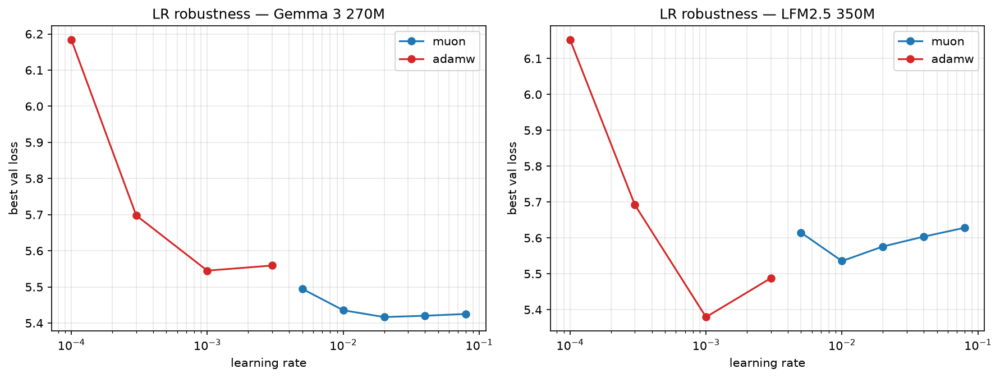
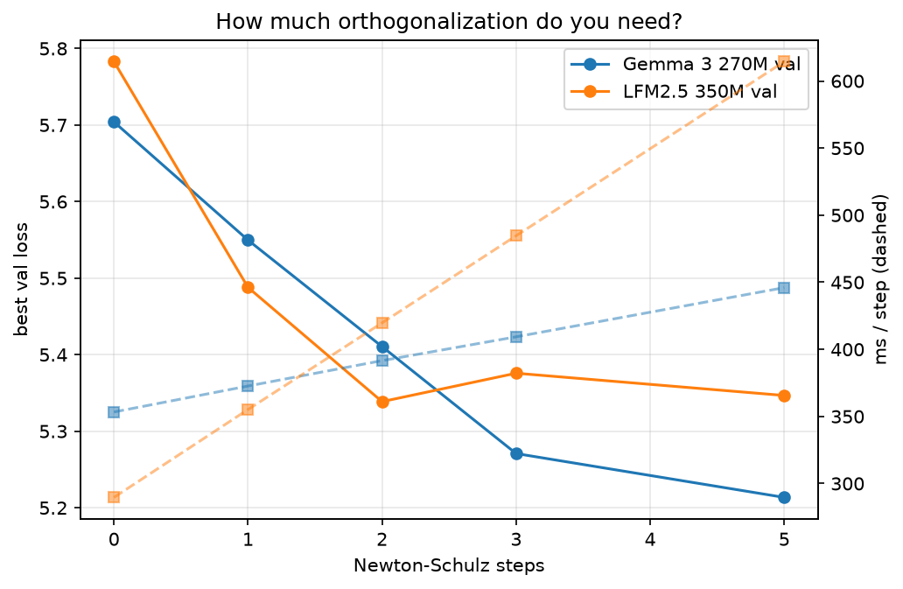

# Part 3 — Muon internals (ablations)

Two cheap ablations on the small **from-scratch** models (Gemma-3-270M, LFM2.5-350M,
random-initialized, WikiText-2) that probe *how* Muon works rather than whether it wins.

## ① Learning-rate robustness — Muon barely cares about your LR

Sweep the LR ~10–16×: Muon's best val loss barely moves, while AdamW falls off a cliff at the
wrong LR.

| Model | Muon spread (16× LR, 0.005→0.08) | AdamW spread (30× LR, 1e-4→3e-3) |
|---|---|---|
| Gemma-3-270M | **0.08** | 0.64 |
| LFM2.5-350M | **0.09** | 0.77 |

**Muon is ~8× more LR-robust.** Tuning is half of training; Muon mostly removes that half.

*Caveat:* on LFM, well-tuned AdamW reaches a slightly lower floor (5.38 at lr 1e-3) than Muon's best
(5.54). So Muon's edge here is **robustness**, not always the lowest achievable loss. On Gemma,
Muon's flat basin also beats AdamW's best.

## ② Newton-Schulz steps — how much orthogonalization do you need?

`ns_steps ∈ {0, 1, 2, 3, 5}`, where **0 = no orthogonalization** (just normalized momentum).

| ns_steps | Gemma val | LFM val | ms/step (Gemma / LFM) |
|---|---|---|---|
| 0 (no orth) | 5.70 | 5.78 | 353 / 290 |
| 1 | 5.55 | 5.49 | 373 / 355 |
| 2 | 5.41 | 5.34 | 392 / 420 |
| 3 | 5.27 | 5.38 | 409 / 485 |
| 5 | **5.21** | 5.35 | 446 / 614 |

- **`ns=0` is clearly worst on both** → it's the *orthogonalization* doing the work, not just momentum.
- **Diminishing returns are model-dependent:** LFM plateaus by **2 steps**; Gemma keeps improving to 5.
- **Cost scales linearly** with steps. On LFM, dropping 5→2 buys back **~30% wall-clock for ~no loss.**

## A note on the third ablation (not used)

We also tracked the **effective (stable) rank** of weight matrices over training, expecting
orthogonalized updates to preserve more rank. It **did not replicate**: Muon kept *higher* rank on
Gemma but *lower* rank on LFM, so we make no claim. The raw numbers are in
[`results_ablations.json`](results_ablations.json) for transparency.

## Caveats

2 small models, single seed, short runs — directional evidence, not a paper. Notebook:
[`experiment3_muon_ablations.ipynb`](experiment3_muon_ablations.ipynb).
